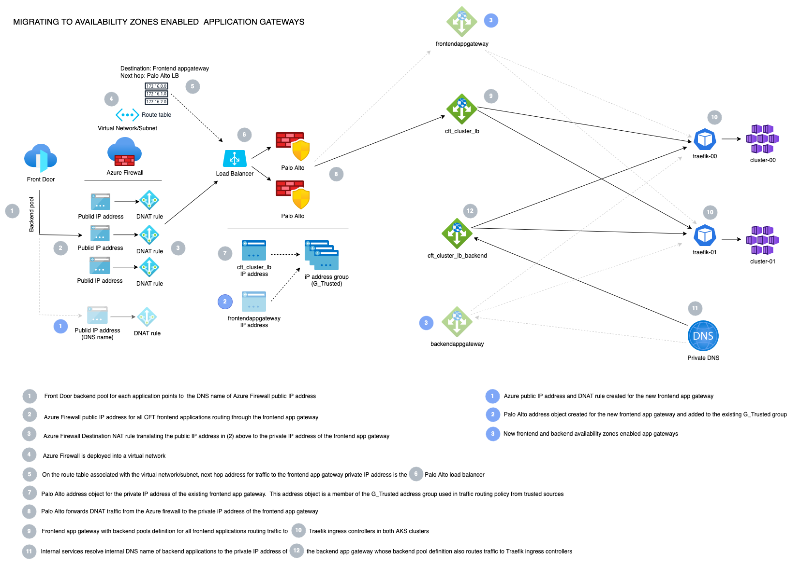
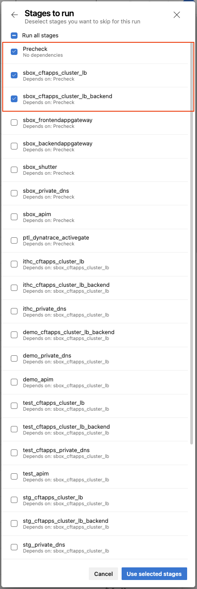

# Migrating to Availability Zones Enabled Application Gateway  
The frontend and backend application gateways deployed in CFT do not support availability zones.  
Enabling availability zones on the existing application gateways will require downtime as the resources will be destroyed and recreated.  The process below details the steps taken to replace the existing application gateways with new availablity zones enabled gateways without application downtime.  

## Traffic flow overview  
  

  
Network flow diagram

  

## Migration steps

**NOTE:** A change request is required for Production implementation

### 1. Create AZ-enabled frontend/backend application gateway resources

- Identify available IP addresses (in the same `appgw` subnet as the existing gateways) for the new frontend and backend application gateways. Take note some environments (demo, perftest and aat) have two backend application gateway and will require 3 IP addresses in total
- Update the environment <env>.tfvars file and add values for the below variables  
    
  `frontend_agw_private_ip_address = "<frontend ip address>"`  
  `backend_agw_private_ip_address = ["<backend ip address>"]`  
  
  See [sbox example](https://github.com/hmcts/azure-platform-terraform/blob/3088e61546dfc921b73540575ba67f40448fa9c1/environments/sbox/sbox.tfvars#L19)  

- Create Azure DevOps pipeline stages for the new `frontendappgateway` and `backendappgateway` components  
  See [sbox pipeline stages example](https://github.com/hmcts/azure-platform-terraform/blob/master/azure_pipeline.yaml#L47-L61)  
  
- Run [azure-platform-terraform](https://dev.azure.com/hmcts/CNP/_build?definitionId=235) pipeline `plan` and confirm the terraform plans for the new appgateway components are correct.  
  Also confirm there are no changes in the terraform plans for the existing `cftapps_cluster_lb` and `cftapps_cluster_lb_backend` appgateway components
- Run the [azure-platform-terraform](https://dev.azure.com/hmcts/CNP/_build?definitionId=235) pipeline `apply` to create the new `frontendappgateway` and `backendappgateway` components 

### 2. Create Azure Firewall and Palo Alto entries

#### Azure Firewall  
- Update the environment [`.tfvars configuration file`](https://github.com/hmcts/rdo-terraform-hub-dmz/tree/1b47237e07a759fb05c74adf749e4749d8f88b8c/env_tfvars) and add an entry for the new `frontendappgateway`  
  See [sbox example](https://github.com/hmcts/rdo-terraform-hub-dmz/blob/1b47237e07a759fb05c74adf749e4749d8f88b8c/env_tfvars/hub-sbox-int.tfvars#L59-L66)  
  Note:   
  - name: Append `-2` suffix to the environment name (though sbox example shown uses a `-test` suffix)  
  - palo_ips: IP address for the new `frontendappgateway`. Specify same value for uksouth
  - index: Pick the next available number
  
#### Panorama
- Update the [`address objects`](https://github.com/hmcts/hub-panorama-terraform/tree/master/components/configuration/groups/objects/address-objects) terraform file with the following
  - Locate the current address object entry (`AKS-<ENV>-APPGW`) for the current frontend application gateway. Directly below this entry, add an address object for the new `frontendappgateway` prefixing the name with `CFT-` with the [`new IP address`](https://github.com/hmcts/hub-panorama-terraform/pull/168/files#diff-0c42cd3d1ea545d1d517f97c83b27056c2ccb88b6c3b38ebc481e4efdf0cdd8a)
  - Locate the [`address group`](https://github.com/hmcts/hub-panorama-terraform/blob/master/components/configuration/groups/objects/address-groups/03-address-groups-nonprod.tf) entry (`AKS-<ENV>-APPGW`) for the current frontend application. [`Add an entry for server object`](https://github.com/hmcts/hub-panorama-terraform/pull/168/files#diff-526b80efaa7838cfbedc705a9fd7597d84ad49d04691315a8dcb88a611eea27d) created above (`CFT-AKS-<ENV>-APPGW`)
  - Locate the [`security policy rule`](https://github.com/hmcts/hub-panorama-terraform/blob/master/components/configuration/groups/policies/security-policy-rules/05-policy-rules-nonprod.tf) for the current AppGw and [`add in the new address object`](https://github.com/hmcts/hub-panorama-terraform/pull/168/files#diff-05ae6c1cde1822a3a1ab839cbd6f072c75bec4a02ffbbcee5cef83c19b0ed302) for the new AppGw

- Further information on the panoramas can be found in the [`hub-panorama-terraform repo additonal materials section`](https://github.com/hmcts/hub-panorama-terraform#additional-materials)

See [`Example Panorma PR`](https://github.com/hmcts/hub-panorama-terraform/pull/168)

After merging PR for the changes above, confirm the [hmcts.hub-terraform-hub-dmz](https://dev.azure.com/hmcts/PlatformOperations/_build?definitionId=226) pipeline run complete successfully without errors for the Azure Firewall
and the [`hmcts.hub-panorama-terraform](https://dev.azure.com/hmcts/PlatformOperations/_build?definitionId=527) pipeline run completes successfully without errors for Panorama
- Confirm the following were created in Azure Firewall in uksouth
  - A `public IP address` associated with the regional Azure firewall
  - A destination NAT `NAT rule collection` entry translating inbound traffic (from Azure Front Door) to the newly created public IP to `frontendappgateway' private IP address
- You now need to push out the panorama changes on the panoramas themselves.
  - login to the panorama portal while on VPN on [`UK South`](https://panorama-prod-uks-0.platform.hmcts.net/)
  - In the top right hand corner, click on the Commit button, you will need to commit and push to the the devices. You can watch a more in depth guide on how to do this [`here in the KT session video from 45 minutes on`](https://cjscommonplatform.sharepoint.com/sites/DTSPlatformOperationsTeam/_layouts/15/stream.aspx?id=%2Fsites%2FDTSPlatformOperationsTeam%2FShared%20Documents%2FKnowledgeShare%2FRedSquadKTSessions%2FPanorama%2C%20Terraform%20and%20the%20Azure%20DevOps%20pipeline%2D20220218%5F101923%2DMeeting%20Recording%2Emp4)

### 3. Test frontendappgateway traffic routing 
Prior to switching over traffic to the new application gateways, test the frontendappgateway by switching a single frontend application to route FrontDoor traffic through the new gateway

- In the environment [`.tfvars configuration file`](https://github.com/hmcts/rdo-terraform-hub-dmz/tree/1b47237e07a759fb05c74adf749e4749d8f88b8c/env_tfvars), identify a suitable frontend application to use for testing. Speak to application team where necessary to make them aware of testing
- Update the `backend domain` of the application above to the `DNS name` of the Azure Firewall public IP address created for the `frontendappgateway`.  
  See [Example PR](https://github.com/hmcts/azure-platform-terraform/pull/1042)
- After PR merge and pipeline run completed, test connection to the Front Door URL for the application and confirm working as normal
- Temporarily enable `frontendappgateway` diagnostics settings access logs and confirm application traffic for the switched applications can be seen in the logs  (Note: It may take a few minutes before log entries start appearing)

### 4. Switchover FrontDoor traffic routing and Private DNS to new gateways
- In the environment [`.tfvars configuration file`](https://github.com/hmcts/azure-platform-terraform/blob/master/environments/), for each application whose `backend domain` points to the`DNS name` of the Azure Firewall public IP address of the existing frontend application gateway (**Note**: some applications such as APIM do not go via the application gateway), update the `backend domain` to DNS name of the Azure Firewall public IP address created for the new `frontendappgateway`    
- In the environment [`backend_lb_configuration.yaml file`](https://github.com/hmcts/azure-platform-terraform/tree/master/environments), for each gateway (some environments have two), update the `private_ip_address` to point to the new `backendappgateway` private iP address  
  See [Example PR](https://github.com/hmcts/azure-platform-terraform/pull/1049)    
  
- After merging PR for the changes above, confirm the [Azure Platform Terraform](https://dev.azure.com/hmcts/CNP/_build?definitionId=235) and [Azure Platform Terraform Global](https://dev.azure.com/hmcts/CNP/_build?definitionId=428) pipelines run complete successfully without errors  
- Confirm applications switched over are accessible as normal  
- Check applications traffic can be seen in the access logs for both frontend and backend application gateways  
- Disable previously-enabled application gateway access logs 
  
### 5. Cleanup old application gateway resources  

#### Application Gateway
- Run [azure-platform-terraform](https://dev.azure.com/hmcts/CNP/_build?definitionId=235) pipeline `destroy` with **ONLY** the old application gateways `<env>_cftapps_cluster_lb` and `<env>_cftapps_cluster_backend_lb` and `Precheck` stages selected  
  

  
Example destroy pipeline stages selection

  
  

- Confirm pipeline run completes successfully without errors and confirm the old application gateways and associated resources have been removed  

#### Application Gateway Pipeline 
- Update the Azure DevOps pipeline [configuration](https://github.com/hmcts/azure-platform-terraform/blob/master/azure_pipeline.yaml) and remove the pipeline stages for the `<env>_cftapps_cluster_lb` and `<env>-cftapps_cluster_lb_backend` gateways  (See [Example PR](https://github.com/hmcts/azure-platform-terraform/pull/1050/files#diff-ac7c0ec21b006c4edccc0f5da7fd89bc8bd73dc77ee8c6ec6b117bb39747416cL47-L62))

#### Azure Firewall
- Update the environment [`.tfvars configuration file`](https://github.com/hmcts/rdo-terraform-hub-dmz/tree/1b47237e07a759fb05c74adf749e4749d8f88b8c/env_tfvars) with the changes below  
  - Remove the new entry earlier created for the new frontend application gateway
  - Update the entry for the existing frontend application gateway and change the `palo_ips` to the new frontend application gateway
  - After merging PR for the changes above, confirm the [hmcts.rdo-terraform-hub-dmz](https://dev.azure.com/hmcts/PlatformOperations/_build?definitionId=226) pipeline run complete successfully without errors  

#### Panorama
- [`Example PR`](https://github.com/hmcts/hub-panorama-terraform/pull/171/files) on cleanup of Panorama for old AppGw's
- login to the panorama portal while on VPN on [`UK South`](https://panorama-prod-uks-0.platform.hmcts.net/) 
  - In the top right hand corner, click on the Commit button, you will need to commit and push to the the devices. You can watch a more in depth guide on how to do this [`here in the KT session video from 45 minutes on`](https://cjscommonplatform.sharepoint.com/sites/DTSPlatformOperationsTeam/_layouts/15/stream.aspx?id=%2Fsites%2FDTSPlatformOperationsTeam%2FShared%20Documents%2FKnowledgeShare%2FRedSquadKTSessions%2FPanorama%2C%20Terraform%20and%20the%20Azure%20DevOps%20pipeline%2D20220218%5F101923%2DMeeting%20Recording%2Emp4)
    
See [Example PR](https://github.com/hmcts/rdo-terraform-hub-dmz/pull/553)

After merging PR for the changes above, confirm the [hmcts.rdo-terraform-hub-dmz](https://dev.azure.com/hmcts/PlatformOperations/_build?definitionId=226) pipeline run completes successfully without errors  

**Note**: If the pipeline run above errors during removal of the Azure Firewall public IP address (see [example error](https://dev.azure.com/hmcts/PlatformOperations/_build/results?buildId=216441&view=logs&j=f2f45dd6-3c86-5d47-e566-a018bc1bfd27&t=c825a317-ded8-5e7b-e541-2086ac118932&s=846d4319-49ec-5071-69a8-bd43ffa774f6)), manually remove the public IP address and re-run the pipeline